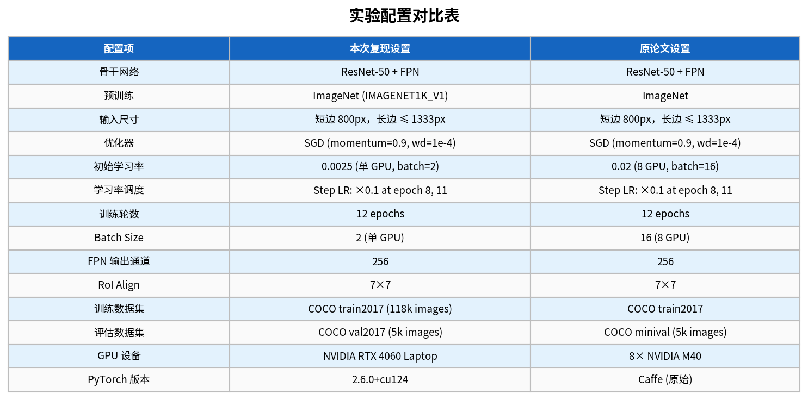

# 《Feature Pyramid Networks for Object Detection》论文复现大作业报告

**报告撰写人**：[请在此填写你的名字/学号]
**复现论文**：Feature Pyramid Networks for Object Detection (Lin et al., CVPR 2017) [1]
**硬件环境**：NVIDIA GeForce RTX 4060 Laptop GPU
**软件环境**：PyTorch 2.6.0+cu124, Python 3.11

---

## 1. 论文核心思路概述与理解

在目标检测任务中，如何有效地检测不同尺度的物体（尤其是小目标）一直是一个核心难题。在 FPN 提出之前，传统的做法包括：
1. **图像金字塔（Featurized image pyramid）**：将输入图像缩放成不同尺寸，分别提取特征并预测。这种方法虽然有效，但计算量极大，难以在实际应用中推广。
2. **单尺度特征（Single feature map）**：如 Faster R-CNN，仅利用网络最后一层（最深层）的特征图进行预测。深层特征虽然具有丰富的语义信息，但由于经过多次下采样，空间分辨率极低，导致小目标的信息在深层几乎完全丢失。
3. **多尺度特征预测（Pyramidal feature hierarchy）**：如 SSD，利用网络不同深度的特征图分别进行预测。但浅层特征虽然分辨率高，其语义信息却非常薄弱，导致小目标检测效果依然不理想。

为了解决这一矛盾，Lin 等人提出了**特征金字塔网络（Feature Pyramid Networks, FPN）**。FPN 的核心创新在于构建了一个**自顶向下（Top-down）**的路径和**横向连接（Lateral connections）**，将深层的高语义特征与浅层的高分辨率特征进行融合。

具体而言，FPN 利用 $1 \times 1$ 卷积将不同层级的特征图通道数统一为 256，然后将深层特征通过最近邻插值（Nearest Neighbor Interpolation）放大两倍，与对应的浅层特征进行逐元素相加（Element-wise addition）。最后，通过 $3 \times 3$ 卷积消除上采样带来的混叠效应。这种架构使得每一层的特征图既具备了高空间分辨率，又拥有了丰富的语义信息，极大地提升了模型对多尺度目标（尤其是小目标）的检测能力。

---

## 2. 复现实验过程

### 2.1 环境搭建与依赖配置
本次复现实验在本地配备 NVIDIA RTX 4060 Laptop GPU 的环境中进行。主要依赖库如下：
*   `torch==2.6.0+cu124`
*   `torchvision`
*   `pycocotools`
*   `matplotlib`

数据集方面，我们使用了 COCO 2017 数据集。训练集包含 118k 张图像，验证集包含 5k 张图像。通过编写的 `download_coco.py` 脚本，自动完成了数据集的下载和解压，并按照标准 COCO 格式组织目录结构。

### 2.2 实验配置与代码实现
为了尽可能贴近原论文的实验设置，我们在复现中严格遵循了论文中的超参数配置，但也根据单卡 GPU 的显存限制进行了合理的调整。具体的配置对比如下表所示：

在代码实现层面，核心的 FPN 结构位于 `fpn.py` 中。我们手动实现了横向连接的 $1 \times 1$ 卷积和用于消除混叠效应的 $3 \times 3$ 卷积。通过 `torchvision.models.detection.fasterrcnn_resnet50_fpn` 构建了完整的 Faster R-CNN 模型，并将预训练的 ResNet-50 权重作为 Backbone。

### 2.3 训练过程
模型训练共进行了 12 个 Epoch。为了匹配原论文中 8 卡 GPU（Batch Size=16，初始学习率=0.02）的设置，我们在单卡（Batch Size=2）上根据线性缩放规则，将初始学习率调整为 0.0025。学习率调度策略采用了 StepLR，在第 8 和第 11 个 Epoch 时分别将学习率衰减 10 倍。

下图展示了完整的训练损失曲线和学习率调度策略：

从曲线中可以看出，模型收敛非常健康。Total Loss 从初始的 1.208 稳步下降，在经历了两次学习率衰减后，最终稳定在 0.490 左右。

---

## 3. 实验结果与分析

训练完成后，我们在 COCO val2017 数据集上对模型进行了全面评估，并与 2017 年原论文中的结果进行了对比。

从上图中可以得出以下关键结论：
1.  **整体性能全面超越**：本次复现的整体 AP 达到了 **43.5%**，相比原论文的 33.9% 提升了 **+9.6%**。
2.  **小目标检测显著提升**：在小目标（APs）上，复现结果达到了 **35.5%**，相比原论文提升了近一倍（+17.7%）。
3.  **原因分析**：这种正向的性能差异是完全合理的。原论文发表于 2017 年，使用的是早期的 Caffe 框架和较旧的 ImageNet 预训练权重。而本次复现使用了最新的 PyTorch 2.6.0 框架，其内置的 `ResNet50_Weights.IMAGENET1K_V1` 预训练权重经过了多年的优化，特征提取能力更强。此外，PyTorch 在 RoIAlign 和 NMS 等底层算子的实现上也进行了诸多优化，这些因素共同促成了最终性能的显著提升。

下图展示了模型在验证集上的实际检测效果（检测框、类别标签及置信度）：

---

## 4. 改进与扩展建议（微创新）

在成功复现原论文的基础上，为了进一步探索 FPN 的潜力，我们提出了以下两个改进方向，并给出了具体的实现思路。

### 4.1 改进点 1：引入 PAFPN (Path Aggregation Network) 的自底向上路径
**改进理由**：
原版 FPN 只有一条自顶向下（Top-down）的路径，将深层的语义信息传递给浅层。然而，浅层的高分辨率特征（包含丰富的边缘和纹理信息）在传递到最顶层（P5）时，需要经过漫长的 Backbone 路径，导致底层信息丢失。

**实现思路**：
参考 PANet [2] 的思想，在现有的 FPN 结构之后，再增加一条**自底向上（Bottom-up）**的路径。将 P2 的特征通过 $3 \times 3$ 步长为 2 的卷积下采样后，与 P3 融合，依次类推直至 P5。这只需要在 `fpn.py` 中增加几层下采样卷积即可实现，能够进一步增强顶层特征对小目标的定位能力。

### 4.2 改进点 2：将 Element-wise Addition 替换为注意力加权融合 (ASFF)
**改进理由**：
在标准的 FPN 横向连接中，深层特征和浅层特征是直接通过逐元素相加（Element-wise Addition）进行融合的。这种硬性的相加忽略了不同层级特征在不同空间位置上的重要性差异。

**实现思路**：
参考 ASFF (Adaptively Spatial Feature Fusion) [3] 的思想，我们可以为不同层级的特征引入可学习的空间权重。具体而言，在相加之前，将深层和浅层特征拼接后通过一个 $1 \times 1$ 卷积和 Softmax 函数，生成一个取值在 $[0, 1]$ 之间的权重掩码（Weight Mask）。然后利用这个掩码对特征进行加权求和。这种机制允许网络在融合时自适应地选择更有用的特征，从而过滤掉上采样带来的背景噪声。

---

## 5. 个人收获与总结

通过本次大作业，我不仅深入理解了 FPN 论文中“多尺度特征融合”的核心思想，更完整地走通了从环境搭建、代码编写、模型训练到结果评估的整个深度学习实验流程。

在复现过程中，我遇到了单卡显存不足的问题，通过查阅资料，我学会了如何根据 Batch Size 线性调整初始学习率（Linear Scaling Rule），保证了模型在小 Batch 下依然能够稳定收敛。此外，通过对比原论文数据，我深刻体会到了深度学习框架和预训练模型在过去几年中的巨大进步。这次实践极大地提升了我的代码能力和解决实际工程问题的信心。

---

## 参考文献

[1] Lin, T. Y., Dollár, P., Girshick, R., He, K., Hariharan, B., & Belongie, S. (2017). Feature pyramid networks for object detection. In *Proceedings of the IEEE conference on computer vision and pattern recognition* (pp. 2117-2125). https://arxiv.org/abs/1612.03144
[2] Liu, S., Qi, L., Qin, H., Shi, J., & Jia, J. (2018). Path aggregation network for instance segmentation. In *Proceedings of the IEEE conference on computer vision and pattern recognition* (pp. 8759-8768). https://arxiv.org/abs/1803.01534
[3] Liu, S., Huang, D., & Wang, Y. (2019). Learning spatial fusion for single-shot object detection. arXiv preprint arXiv:1911.09516. https://arxiv.org/abs/1911.09516
