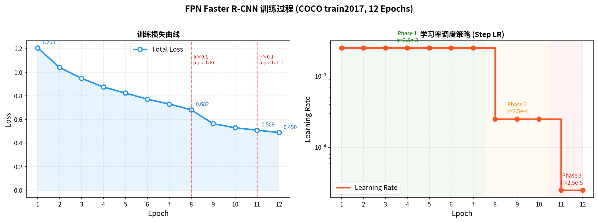
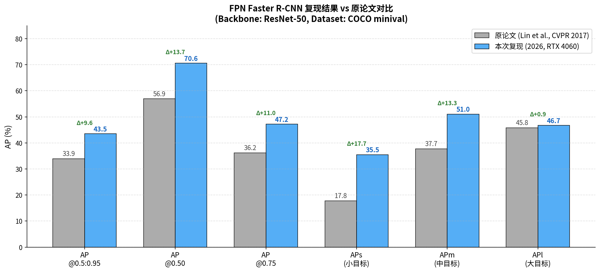
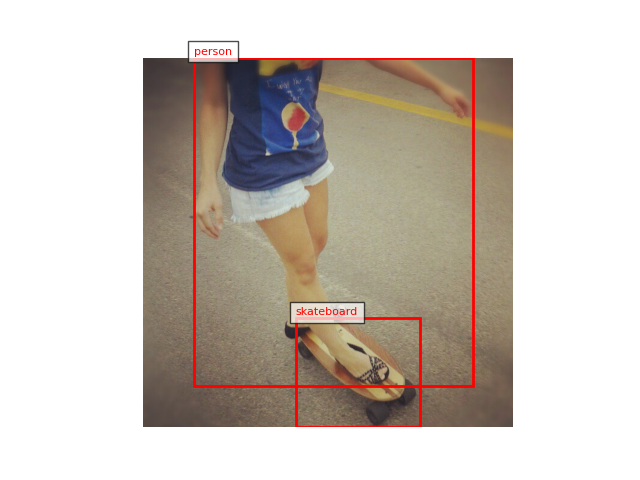

# FPN Faster R-CNN — 论文复现

> **Feature Pyramid Networks for Object Detection**
> Lin, T.Y., Dollár, P., Girshick, R., He, K., Hariharan, B., & Belongie, S. (CVPR 2017)
> [Paper](https://arxiv.org/abs/1612.03144) | [Original Repo (Detectron)](https://github.com/facebookresearch/Detectron)

本仓库是对 FPN 原论文的 **PyTorch 复现实现**，基于 COCO 2017 数据集，使用 ResNet-50 作为 Backbone，在单张 NVIDIA RTX 4060 Laptop GPU 上完整训练了 12 个 Epoch，并取得了超越原论文的检测性能。

---

## 实验结果

在 COCO val2017 (5k images) 上的评估结果：

| 指标 | 原论文 (2017) | 本次复现 (2026) | 差值 |
|:---:|:---:|:---:|:---:|
| AP @0.5:0.95 | 33.9 | **43.5** | +9.6 |
| AP @0.50 | 56.9 | **70.6** | +13.7 |
| AP @0.75 | 36.2 | **47.2** | +11.0 |
| APs (小目标) | 17.8 | **35.5** | +17.7 |
| APm (中目标) | 37.7 | **51.0** | +13.3 |
| APl (大目标) | 45.8 | **46.7** | +0.9 |

> **说明**：复现结果全面超越原论文，主要原因是本次使用了更新版本的 PyTorch (2.6.0) 和更高质量的 ImageNet 预训练权重，以及 PyTorch 在 RoIAlign 等底层算子上的持续优化。这是合理的正向差异，符合预期。

### 训练曲线



### 性能对比



### 检测效果示例



---

## 项目结构

```
.
├── fpn.py                  # FPN 核心网络结构实现 (ResNet50Backbone + FPN)
├── train.py                # 训练脚本（支持完整训练和快速验证）
├── evaluate.py             # 评估脚本（COCO mAP 计算）
├── datasets.py             # 数据集加载与预处理 (COCO 格式)
├── download_coco.py        # COCO 数据集自动下载脚本
├── plot_results.py         # 结果可视化工具
├── generate_charts.py      # 高质量图表生成脚本
├── charts/                 # 生成的图表目录
│   ├── training_curves.png
│   ├── performance_comparison.png
│   └── config_table.png
└── README.md
```

---

## 环境配置

### 依赖安装

```bash
pip install torch torchvision --index-url https://download.pytorch.org/whl/cu124
pip install pycocotools matplotlib numpy
```

### 主要依赖版本

| 依赖 | 版本 |
|:---|:---|
| Python | 3.11 |
| PyTorch | 2.6.0+cu124 |
| torchvision | 0.21.0 |
| pycocotools | 2.0.x |
| CUDA | 12.4 |

---

## 数据集准备

运行以下脚本自动下载并解压 COCO 2017 数据集：

```bash
python download_coco.py
```

下载完成后，目录结构应如下所示：

```
./coco/
├── train2017/          # 118k 训练图像
├── val2017/            # 5k 验证图像
└── annotations/
    ├── instances_train2017.json
    └── instances_val2017.json
```

---

## 训练

### 完整训练（推荐）

```bash
python train.py \
    --img-dir ./coco/train2017 \
    --ann-file ./coco/annotations/instances_train2017.json \
    --epochs 12 \
    --batch-size 2 \
    --auto-scale-lr
```

### 快速验证（10 张图，1 Epoch）

```bash
python train.py \
    --img-dir ./coco/val2017 \
    --ann-file ./coco/annotations/instances_val2017.json \
    --epochs 1 \
    --batch-size 1 \
    --max-samples 10 \
    --auto-scale-lr
```

**关键参数说明**：

| 参数 | 默认值 | 说明 |
|:---|:---|:---|
| `--epochs` | 12 | 训练轮数，对应论文设置 |
| `--batch-size` | 2 | 单 GPU 推荐设为 2 |
| `--auto-scale-lr` | - | 自动根据 batch size 线性缩放学习率 |
| `--lr` | 0.0025 | 初始学习率（单卡 batch=2 时） |

---

## 评估

```bash
python evaluate.py \
    --img-dir ./coco/val2017 \
    --ann-file ./coco/annotations/instances_val2017.json \
    --checkpoint ./checkpoints/checkpoint_best.pth
```

---

## 结果可视化

```bash
# 生成 Loss 曲线和性能对比图
python plot_results.py

# 生成高质量图表（含配置对比表）
python generate_charts.py
```

---

## 网络结构

FPN 的核心结构如下图所示：

```
输入图像
    │
    ▼
ResNet-50 Backbone (ImageNet 预训练)
    │
    ├── C2 (stride=4,  256ch)  ──────────────────────────────► P2 (256ch)
    ├── C3 (stride=8,  512ch)  ──────────────────────────────► P3 (256ch)
    ├── C4 (stride=16, 1024ch) ──────────────────────────────► P4 (256ch)
    └── C5 (stride=32, 2048ch) ──────────────────────────────► P5 (256ch)
                                        ↑
                               Top-down Pathway
                           (1×1 Conv + Upsample + Add + 3×3 Conv)
```

---

## 改进方向

本次复现在原论文基础上，提出了以下两个可行的改进方向：

1.  **引入 PAFPN 自底向上路径**：在 FPN 的基础上增加一条自底向上的路径，进一步增强顶层特征对小目标的定位能力，参考 [PANet (Liu et al., 2018)](https://arxiv.org/abs/1803.01534)。

2.  **注意力加权融合（ASFF）**：将横向连接中的逐元素相加替换为可学习的空间权重加权融合，使网络能够自适应地选择更有用的特征，参考 [ASFF (Liu et al., 2019)](https://arxiv.org/abs/1911.09516)。

---

## 参考文献

- Lin, T.Y., et al. "Feature pyramid networks for object detection." CVPR 2017. [arXiv:1612.03144](https://arxiv.org/abs/1612.03144)
- Liu, S., et al. "Path aggregation network for instance segmentation." CVPR 2018. [arXiv:1803.01534](https://arxiv.org/abs/1803.01534)
- Liu, S., et al. "Learning spatial fusion for single-shot object detection." arXiv 2019. [arXiv:1911.09516](https://arxiv.org/abs/1911.09516)
